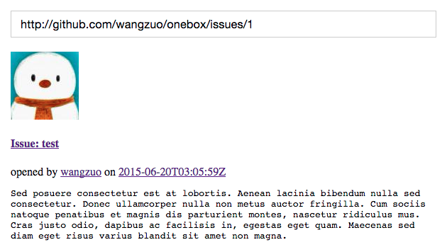

# onebox
[onebox](https://github.com/discourse/onebox) with node

> Onebox is a library for turning media URLs into simple HTML previews of the resource.



### Installation
``` sh
npm install onebox --save
```
### Usage
``` javascript
var onebox = require('onebox');
var link = 'http://github.com/wangzuo/onebox/issues/1';
onebox.preview(link, function(err, html) {
  if(err) throw err;
});
```
### Development preview server
``` sh
npm start
```

### Link support
- [ ] amazon
- [ ] audio
- [ ] douban
- [ ] github_blob
- [ ] github_commit
- [ ] github_gist
- [ ] github_issue
- [ ] github_pullrequest
- [ ] google_calendar
- [ ] google_docs
- [ ] google_maps
- [ ] google_play_app
- [ ] html
- [x] image
- [ ] json
- [ ] pubmed
- [x] soundcloud
- [ ] stack_exchange
- [ ] standard_embed
- [ ] twitter_status
- [ ] video
- [ ] whitelisted_generic
- [ ] wikipedia
- [ ] spotify
- [ ] youku
- [ ] youtube
- [x] music163song
- [x] music163playlist
- [ ] 404 error
- [ ] timeout error
- [ ] open graph
